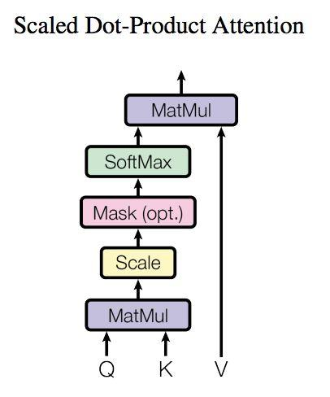

## 单层 transformer 基本结构


https://zhuanlan.zhihu.com/p/338817680


只使用左侧的encoder




多头就是使用多组权重矩阵，做上面的操作


## 我的任务

将时间-温度序列数据转化为一维特征向量

- 输入(seq_len,batch_size,dim)，输出(1,dim)

  ```
  [
  	[
  		[12,30]
  	],
  	[
  		[13,31]
  	],
  	[
  		[14,20]
  	]
  ]
  ```

  

## 预训练模型

现有的都是nlp的词嵌入模型，不是时间序列模型，但也可以使用词嵌入的预训练模型来做时间序列的编码。
